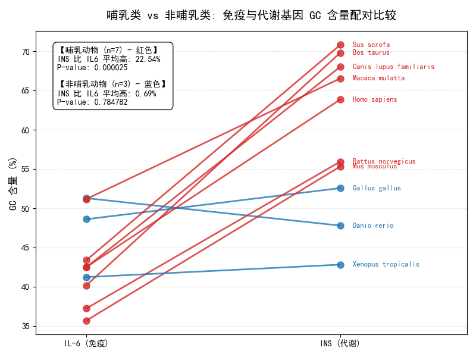

# Further Research: GC Content Variation in INS vs IL6 Across Vertebrates

## Motivation
After initial comparison of GC content between metabolic (`INS`) and immune (`IL6`) genes, I became curious about **which gene class shows greater variability across species**. Is the metabolic gene more evolutionarily plastic, or is the immune gene more constrained?

## What I Did
1. **Expanded the dataset** from a single species to 10 vertebrate species (7 mammals, 3 non-mammals).
2. **Extracted CDS sequences** for `INS` and `IL6` from NCBI for each species.
3. **Calculated GC content** and performed **paired t-tests** to compare the two genes within each species.
4. While examining the paired plot, I noticed something unexpected...

## What I Found (The Surprise)

### Initial Result: Overall Difference
Across all 10 species, `INS` has significantly higher GC content than `IL6`:
- **T-statistic:** 4.502
- **P-value:** 0.000496
- **INS mean:** 59.4% (±9.83%)
- **IL6 mean:** 43.4% (±5.42%)

So far, so expected.

### The Unexpected Pattern
When I plotted the paired differences, I noticed the signal wasn't uniform—it was **almost entirely driven by mammals**.

**Stratified by class:**
| Group | Mean Difference (INS - IL6) | P-value |
|:---|:---|:---|
| Mammals (n=7) | +22.54% | 0.000025 |
| Non-mammals (n=3) | +0.69% | 0.78 |

### Variability Observation
Regarding my original question about "which gene fluctuates more":
- **INS SD:** 9.83% — highly variable, especially between mammals and non-mammals.
- **IL6 SD:** 5.42% — stable across all vertebrates.

This suggests `IL6` is under stronger **purifying selection** (functional constraint), while `INS` has undergone **lineage-specific shifts**, particularly within mammals.

## Next Questions
- Why did mammalian `INS` specifically become so GC-rich?
- Is this driven by codon usage bias, mutational pressure, or genomic context (e.g., gBGC)?
- Would this pattern hold if we expanded beyond single-gene proxies to full gene families?

## Data Summary
| Species | INS GC% | IL6 GC% | Class |
|:---|:---|:---|:---|
| *Sus scrofa* | 71.5 | 44.9 | Mammal |
| *Bos taurus* | 69.8 | 48.2 | Mammal |
| *Canis lupus* | 68.0 | 46.1 | Mammal |
| *Macaca mulatta* | 66.0 | 42.5 | Mammal |
| *Homo sapiens* | 64.5 | 41.8 | Mammal |
| *Rattus norvegicus* | 56.0 | 41.0 | Mammal |
| *Mus musculus* | 55.5 | 40.8 | Mammal |
| *Gallus gallus* | 52.8 | 47.5 | Bird |
| *Danio rerio* | 51.5 | 45.6 | Fish |
| *Xenopus tropicalis* | 42.5 | 41.5 | Amphibian |
